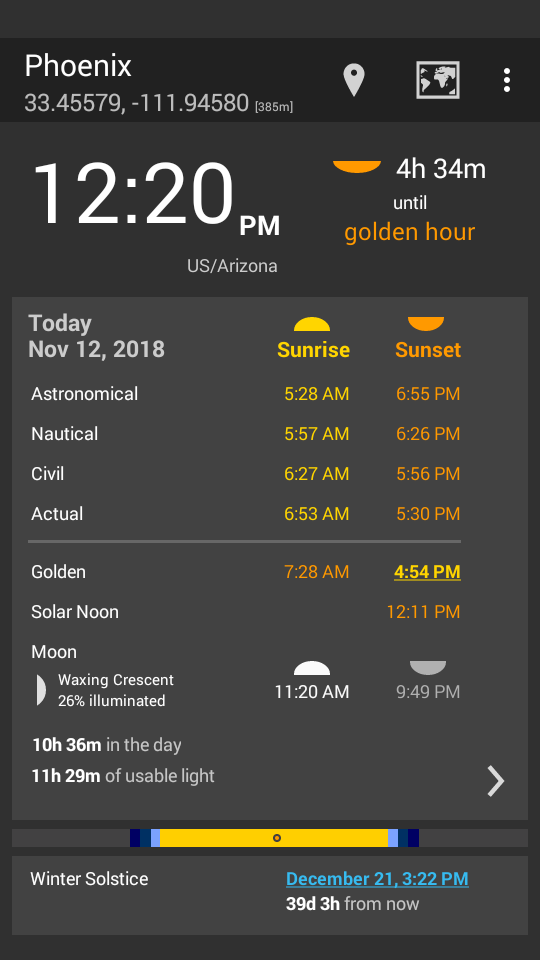
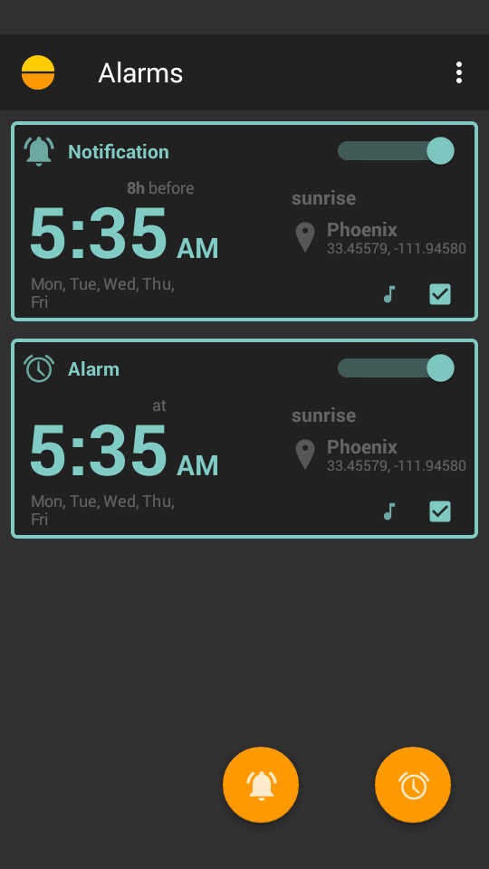

&nbsp; Displays sunrise and sunset, twilights, blue and golden hour, solstices and equinoxes, moonrise and moonset, moon phases and illumination.

     <u>Suntimes Alarms</u> An alarm clock with support for daily repeating alarms and notifications.
    
     [Suntimes Calendars](https://f-droid.org/en/packages/com.forrestguice.suntimescalendars/)  A calendar provider add-on.
    

Do you find value in this app? `Please pay what you want.`  
 

&nbsp;&nbsp;
&nbsp;&nbsp;

## Philosophy
To create an application that is:

1) **high quality**: solves a problem with well defined scope (and solves it well).
2) **libre software**: grants essential software freedoms.
3) **respectful of privacy**: no ads, no network access, no non-essential permissions, no bullshit.
4) **accessible**: usable by a wide range of people with individual capability.
5) **localized**: support for multiple languages, rules, and formats.
6) **compatible**: runs on the widest range of devices possible (support for older devices).
